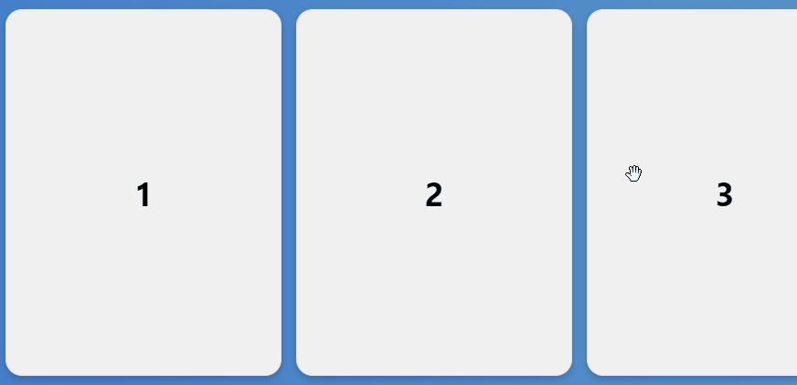

# svelte-horizontal-scroller


A pretty straightforward, simple, and unstyled Horizontal Scroller for Svelte.

Support for mobile touch and cursor drag & drop.

## Demo

[LIVE DEMO](https://svelte.dev/repl/d37e9362f2284ea0a5bcd7011005ee19?version=3.38.3)



## How to install

> npm install svelte-horizontal-scroller

## How to use it

```sveltehtml
<script>
    import HorizontalScroller from "svelte-horizontal-scroller"
</script>

<HorizontalScroller>
    Add your items here
</HorizontalScroller>
```

## Styling

This component has almost no styles on it (beyond those necessary for its functionality), but you can change the
padding, width, and default item gaps declaring the following variables on your global css:

| Variable      | Default Value |
| --------- | -----:|
| --horizontal-scroller-width  | auto |
| --horizontal-scroller-padding     |   1em |
| --horizontal-scroller-gap      | 1em  |


